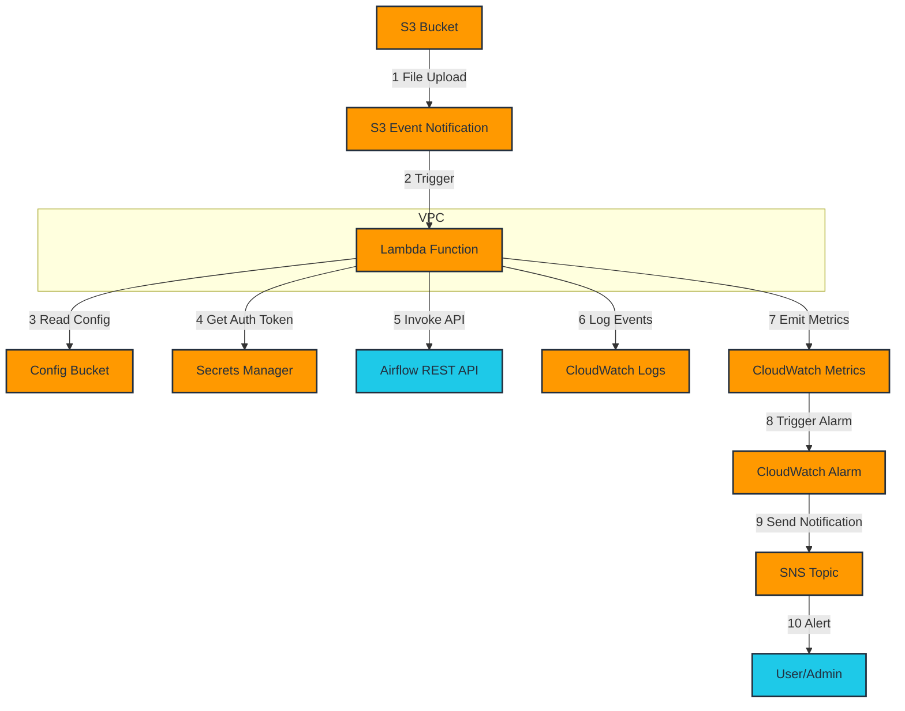

# AWS S3 File Upload Trigger - API Invoker

This project sets up an AWS Lambda function that is triggered by S3 events to invoke Airflow REST APIs based on configurable patterns.

## Features

- S3 event-driven Lambda function
- Configurable trigger patterns and API endpoints
- VPC-bound Lambda for secure networking
- CloudFormation template for easy deployment
- IAM role with boundary policy for enhanced security

## Prerequisites

- AWS CLI installed and configured
- Python 3.8 or later
- An existing VPC and S3 bucket
- Permissions to create IAM roles and Lambda functions

## Architecture



## Deployment

1. Clone this repository:
   ```
   git clone https://github.com/yourusername/s3-airflow-trigger.git
   cd s3-airflow-trigger
   ```

2. Update the `config/sample_config.json` file with your specific trigger patterns and API endpoints.

3. Deploy the CloudFormation stack:
   ```
   aws cloudformation create-stack --stack-name AirflowTriggerStack \
     --template-body file://templates/cloudformation.yaml \
     --parameters \
       ParameterKey=VpcId,ParameterValue=vpc-12345678 \
       ParameterKey=SubnetIds,ParameterValue=subnet-12345678,subnet-87654321 \
       ParameterKey=S3BucketName,ParameterValue=my-existing-bucket \
       ParameterKey=ConfigBucketName,ParameterValue=my-config-bucket \
       ParameterKey=ConfigKey,ParameterValue=config.json \
       ParameterKey=PermissionsBoundaryPolicy,ParameterValue=arn:aws:iam::123456789012:policy/MyBoundaryPolicy \
     --capabilities CAPABILITY_IAM
   ```

   Replace the parameter values with your own VPC, subnet, and S3 bucket information.

4. Upload your configuration file to the specified S3 bucket:
   ```
   aws s3 cp config/sample_config.json s3://my-config-bucket/config.json
   ```

## Usage

Once deployed, the Lambda function will automatically be triggered when files are uploaded to the specified S3 bucket. It will check the uploaded file against the patterns in the configuration file and invoke the corresponding Airflow API if a match is found.

To update trigger patterns or API endpoints, simply modify the configuration file in the S3 bucket. The Lambda function will use the updated configuration on its next invocation.

## Contributing

Please read [CONTRIBUTING.md](CONTRIBUTING.md) for details on our code of conduct and the process for submitting pull requests.

## License

This project is licensed under the Apache 2.0 License - see the [LICENSE](LICENSE) file for details.
